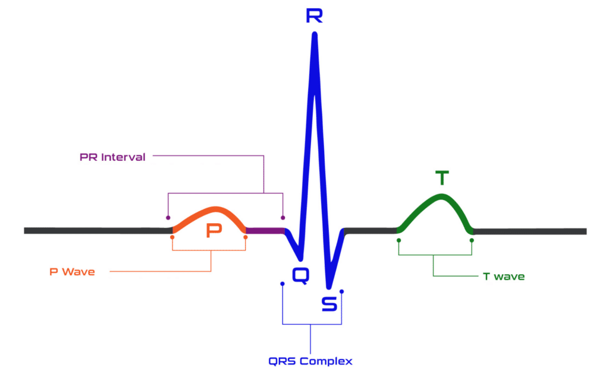

# BEng Biomedical Engineering
### Object-Oriented Programming (5CCYB041) &ndash; Assessment 1


## Objective

To gain practical experience of C++ coding using a suitable IDE (integrated development environment). 


# Assessment criteria

Try to use variable/function naming, comments and indentation to make your program as easy to understand as possible. Also try to make your program as resilient to runtime errors as possible. 

Your submission will be marked based on a number of factors: 

| Criterion | weighting |
|:---|:---:|
| code compiles | 5% |
| program runs successfully | 5% |
| program produces correct results | 5% |
| program handles command-line arguments as expected | 5% |
| code includes appropriate error handling | 5% |
| code is designed to be modular and reusable | 10% |
| code is organised across multiple files | 5% | 
| code is well-organised and legible | 5% |
| code indentation is correct, and appropriate use of comments | 5% |


---

# Introduction 

An electrocardiogram (ECG) records the electrical activity of the heart. Each heartbeat produces a characteristic waveform with the following components (see figure below): 
- the P-wave (atrial depolarisation), 
- the QRS complex (ventricular depolarisation)
- the T-wave (ventricular repolarisation) 
. The R-peak is the tallest point of the QRS complex. 

Heart Rate Variability (HRV) is a key clinical metric used in wearable health devices to assess the autonomic nervous system. HRV is derived by analysing the time intervals between consecutive R-peaks (in milliseconds), known as RR intervals. 




# Instructions 

Your task in this assessment is to write a C++ program to read an ECG signal from a file, detect the R-peaks of the QRS complex, compute R-R intervals, determine Heart Rate Variability (HRV) metrics, and write a formatted analysis report to an output file.

Your program should perform the following main steps (these are described in more detail below):
1. Load the ECG data from a text file specified as a command-line argument.
2. Detect R-peaks (QRS detection) in the ECG signal using a threshold-based peak detection algorithm. 
3. Compute R-R intervals from the detected R-peaks, by calculating the time difference (in milliseconds) and instantaneous heart rate (in BPM) for each consecutive pair of peaks.
4. Compute HRV metrics from the R-R intervals, including: Mean R-R interval, SDNN (standard deviation of R-R intervals), RMSSD (root mean square of successive differences), and mean/min/max heart rate.
5. Classify the stress level based on the computed RMSSD value using clinical reference thresholds.
6. Write a summary of the analysis to an output text file (specified as a command-line argument), listing all detected peaks, R-R intervals, and the HRV summary.

## Command-line interface 

Your program should accept at least 2 arguments: the filename containing the ECG recording, and the filename to use for the output file for the report of the analysis. 

If a third argument is provided, this should be interpreted as a voltage threshold $V_{\textrm{threshold}}$ in mV for the peak detection, which should be set to 0.5mV by default.

If a fourth argument is provided, this should be interpreted as the minimum time $t_{\textrm{min}}$ (in seconds) between peaks, which should be set to 0.3s by default.


## Loading the data and determining the block size 

You are provided with two data files (`ecg_data1.txt` and `ecg_data2.txt`) containing synthetic ECG signals. Each line in these files contains two values: the time in seconds and the voltage in mV of the sampled signal.

## Detecting the R-peaks

Your task is to implement a threshold-based peak detection algorithm. The algorithm scans through the ECG signal and identifies a sample at index i as an R-peak if all three of the following conditions are met:
- It is a local maximum: $V[i]>V[i-1]$ and $V[i]>V[i+1]$ 
- Its voltage exceeds the threshold: $V[i] > V_{\textrm{threshold}}$
- Sufficient time has elapsed since the last detected peak (refractory period): $t[i]-t[\textrm{last peak}] >= t_{\textrm{min}}$


## Computing the R-R intervals

Once R-peaks have been detected, compute the R-R intervals in milliseconds by calculating the time difference between each consecutive pair of peaks (remember to take the sampling time interval into account). For each R-R interval, also compute the instantaneous heart rate in beats per minute (BPM), which is computed as $\textrm{BPM}[i] = 60,000 / \textrm{RR}[i]$ (where $\textrm{RR}[i]$ is the $i$th  R-R interval in milliseconds).


## Computing the HRV metrics 

From all the R-R intervals, compute the following clinical HRV metrics: 
- The arithmetic mean of all R-R interval durations (in ms)
- The RMSSD (Root Mean Square of Successive Differences), computed from the successive differences between adjacent R-R intervals $t_{\textrm{RR}}$ as:

$$ \textrm{RMSSD} = \sqrt{ \frac{1}{N-1} \sum_i^{N-1} \left( \textrm{RR}[i] - \textrm{RR}[i-1] \right)^2 } $$

  ![$$ \textrm{RMSSD} = \sqrt{ \frac{1}{N-1} \sum_i^{N-1} \left( \textrm{RR}[i] - \textrm{RR}[i-1] \right)^2 } $$](eqn.png)

## Classifying the stress level 

Based on simplified clinical reference ranges, the RMSSD value should be used to classify the stress level as follows:

| RMSSD Range | Classification | Interpretation | 
|---|---|:---|
| > 50 ms | Low Stress | Good parasympathetic tone | 
| 20 – 50 ms | Moderate Stress | Normal range |
| < 20 ms | High Stress | Low HRV — consider follow-up |
 
## Print the result

Write the final report to the text file specified as the second argument on the command-line. This should include the name of the file containing the EGC signal, the mean of the R-R intervals, the RMSSD and the stress level, in a format similar to:
```
data file: ecg_data1.txt
mean RR interval: 1.2
RMSSD: 1.123
stress level: low
```

